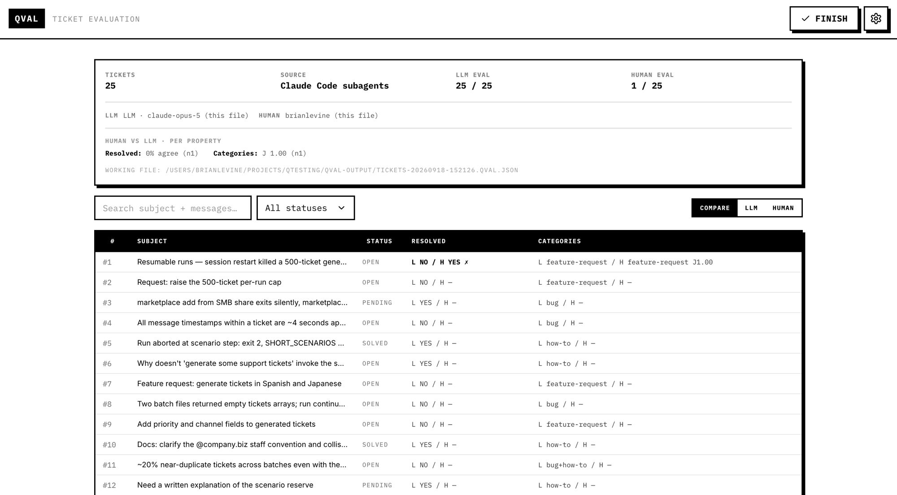

# Qval

A local-first **Claude Code plugin** for evaluating customer support tickets with an LLM, with humans, and then comparing the two. It scores any ticket set in [the ticket format](#the-ticket-format), whether you exported it from your own helpdesk or generated it with [Qbort](https://github.com/balevine/qbort), Qval's sibling tool for making realistic fake ones.

It is three commands. `/qval:draft` comes first and writes the scoring config, from your own rules or a description. Then, in either order, `/qval:evaluate-tickets` runs the LLM evaluation, either inside Claude Code on whatever model your session is using or, if you chose it, through Typesafe's Jev, and `/qval:review` opens a browser tab for the parts a person has to do by hand, which are adjusting the schema and the rules, filling in the human evaluation ticket by ticket, and reading the comparison. Both halves read and write the same `*.qval.json`, and two people's files of the same ticket set **merge** into per-ticket means, distributions, and a human-vs-LLM comparison.

Everything runs on your machine. Scoring with Claude needs no API key and no provider to configure. The review UI is served from `127.0.0.1`, and the only network egress is Claude Code's own, plus Typesafe's API if you choose the optional [Jev scorer](#scoring-with-jev).



**Highlights**

- **No API key** for Claude scoring. The evaluation runs on the ambient Claude model through parallel subagents, with a dependency-free Node engine owning everything structural (schema validation, fingerprints, batching, per-value validation, atomic writes). Ticket content never enters the orchestrating agent's context.
- **Typed schema** (score / boolean / enum / text, each optionally multi-valued) and **free-form rules**, both snapshotted into every eval file and hashed into a fingerprint that merging gates on.
- LLM and human scores are pooled **separately** and compared per property. The gap between them is the output, not an afterthought.
- Nothing to install past the plugin itself. No build step, no `npm install`, no PATH management. Just Node.

---

## Install

In Claude Code:

```
/plugin marketplace add balevine/qval
/plugin install qval@qval
```

"Marketplace" is a misleading word for it. It means a git repo with a manifest in it, and there is no listing and no approval from anyone.

If you would rather read the source before running it, clone the repo and point Claude Code at the clone. The repo root is itself the marketplace, so it installs the same way a remote does.

```bash
git clone https://github.com/balevine/qval
```
```
/plugin marketplace add ./qval
/plugin install qval@qval
```

Requires **Node.js 20+** on your `PATH`. Nothing else.

All three skills set `disable-model-invocation: true`, so they cost nothing in your context window until you type them. The trade is that asking in prose ("evaluate these tickets") will not trigger them. Type `/qval:draft`, `/qval:evaluate-tickets`, or `/qval:review`.

---

## The ticket format

A ticket file is JSON: either `{ meta, tickets: [...] }` or a bare array of tickets. `meta` is optional and only ever displayed. Each ticket is

```json
{
  "id": 1,
  "subject": "Refund not received",
  "status": "open",
  "messages": [
    {
      "from": { "name": "Dana Okonkwo", "email": "dana@example.com" },
      "body": "I returned the order two weeks ago and haven't seen the refund.",
      "isStaff": false,
      "createdAt": "2026-09-01T10:00:00Z"
    }
  ]
}
```

Only the integer `id` is required, and it only has to be unique within the file. Everything else is filled in when it's missing, so a thin export still works: `status` falls back to `open` (the recognized values are `new`, `open`, `pending`, `on-hold`, `solved`, `closed`), and absent text becomes empty. Unknown fields are ignored, so you can leave whatever else your helpdesk exports in place. `messages[0]` is read as the opening message and the rest as the conversation in order. `isStaff` is what separates your agents from the customer in the rendered prompt.

**Exporting your own data is a supported path, not a workaround.** Write a small script that maps your helpdesk's export into the shape above and you are done. Nothing downstream cares where the file came from.

## Usage

Put your ticket file in a directory and open Claude Code there. Qval reads and writes in the working directory and never modifies the ticket set. **The filename doesn't matter**: Qval finds a dataset by reading the `.json` files in the directory and checking which ones parse as tickets, so `zendesk-export-q3.json` is found exactly like `tickets.json`. You can always name the file explicitly instead.

If you generated the set with [Qbort](https://github.com/balevine/qbort), there is nothing to move: it writes `qbort-output/tickets-YYYYMMDD-HHMMSS.json`, and that one subdirectory is searched as well as the working directory. Qbort keeps every run, so once you have generated a few you will be asked which one you meant.

### 1. Draft the config

```
/qval:draft
```

Every evaluation scores against two files in the working directory, **`EVAL_RULES.md`** and **`EVAL_SCHEMA.json`**, and this command is what writes them. Neither of the other two creates them. `/qval:review` refuses to start a new evaluation without them (`NO_CONFIG`), and `/qval:evaluate-tickets` stops and sends you here.

- **Rules** are a free-form block telling the evaluator *how* to score (prose, definitions, scoring philosophy, edge cases). They go to the scorer verbatim and sit next to the human form in the browser.
- **Schema** is the ordered list of typed properties every ticket is scored on. Each one has a `label`, a camelCase `key`, a `type` (**score**, **boolean**, **enum**, or **text**), an optional `multiple` flag for multi-valued answers, and a `description` shown to both the scorer and the human.

`EVAL_SCHEMA.json` names its **scorer** as well as its properties:

```json
{
  "scorer": "claude",
  "properties": [
    { "key": "resolved", "label": "Resolved", "type": "boolean", "description": "Was the issue actually resolved?" }
  ]
}
```

The scorer is what scores the tickets, and an evaluation has exactly one. Drafting is the only place it is chosen. `claude` is the ambient Claude model (see [Scoring with Claude](#scoring-with-claude)). `jev` is Typesafe's Jev, run through Typesafe's API (see [Scoring with Jev](#scoring-with-jev)). A file that is a bare array of properties, which is what every earlier version wrote, is still read, as `claude`. Anything Qval writes back is the wrapped form.

There are three ways to draft.

**Rules first.** Write your scoring rules in plain language in a **`RULES.md`** in the working directory, questions and all. Claude asks which scorer you want and drafts both files from `RULES.md` for that scorer. `EVAL_SCHEMA.json` gets one property per question, with only the fields that scorer reads. `EVAL_RULES.md` is your rules with the question lists and any output format taken out, since the properties now ask the questions and Qval supplies its own output format. It is what the scorer is sent and what the config fingerprint covers.

The engine checks the draft (`draft-check`), Claude fixes what it reports at most twice, and then you see the properties as a table along with Claude's notes on each, warnings about definitions the draft is missing or rules it cannot enforce, and exactly what was taken out of your rules. Nothing is written until you approve. Then `draft-apply` writes the two config files, replacing any that were there, and names any eval files that were already scored under other criteria (those are left alone, and the new config is scored into a new eval file). It refuses while a review session is open in the directory, because that session writes its own config back when it ends.

**`RULES.md` is never modified**, and every redraft starts from it. To change what is measured, change `RULES.md` and draft again.

**From a description.** Without a `RULES.md`, describe what you want measured in a sentence or two and Claude writes a `claude` config, then shows you the validated schema as a table.

**The starter config.** If you would rather start from something and edit it in the browser, ask for the starter config and Qval's built-in schema and rules are written as they are.

Hand-written config files work too. Anything that passes `config` is a config.

Full skill docs: [`plugin/skills/draft/README.md`](plugin/skills/draft/README.md).

### 2. Score the tickets

```
/qval:evaluate-tickets
```

The skill checks the config, then runs the scorer it names. It runs before or after a review, in either order.

#### Scoring with Claude

The skill confirms the model to record, plans the run, fans the batches out to parallel subagents, assembles the results, and runs **one** retry round over anything that failed or came back off-schema. The result is a `*.qval.json` in **`qval-output/`**, named after the ticket file it scored. No API key is involved.

Validation is **per value, never per ticket**. Each value is coerced where that is unambiguous (a score clamped to range and snapped to step, an enum case-matched to a canonical option) or **dropped** where it isn't, leaving that one property unscored rather than discarding the ticket's other answers. Every coercion and drop is recorded in the result's `issues[]`, so nothing is silently faked. On a multi-valued property an empty list means "none apply" and is a real answer, so a value the model couldn't produce is dropped instead of being turned into one.

Ticket text goes to the model fenced and labeled as data, and a ticket that forges its own fence markers has them defused. A support inbox is full of text written by strangers, and it is worth knowing that a ticket asking for a good score is something the evaluator is told to judge rather than obey.

#### Scoring with Jev

A `jev` schema reads extra fields from each property, because Jev never sees the keys and is sent the question text instead. `instructions` (the question itself) is required, and the text of instructions plus description has to differ between properties. A `boolean` can add `trueDescription` and `falseDescription`. An `enum` can add `optionDescriptions`, a map from each option to its definition. A multi-select `enum` is sent as one yes or no question per option, and can give each option its own question with `optionInstructions`, `optionTrueDescriptions`, and `optionFalseDescriptions` (maps keyed by option, for every option or none). Jev then reads each option's instructions plus its definition, which has to differ between options too. A `score` needs `levels`, a list of two to ten `{ "label", "description" }` entries (ten is the most the Typesafe API accepts), lowest first, and is stored as `min: 0`, `max: levels.length - 1`, `step: 1`. Jev cannot score `text` properties or a multi-valued `score`, and `config` refuses both. Under `claude` these fields are ignored. Drafting from `RULES.md` writes them for you.

A `jev` config is scored by the engine itself, with no subagents. It sends one request per ticket to `https://api.typesafe.ai/v1/systemone`, carrying your `EVAL_RULES.md`, the ticket (rendered and fenced exactly as the Claude prompt renders it), and one question per property. A multi-valued enum is asked as one yes-or-no question per option and folded back into the selected set. A yes is a probability of 0.5 or more. A score answer such as 1.43 is snapped to the nearest level and recorded as `clamped`, with what Jev said kept in `issues[]`. Every answer then goes through the same per-value validation as a Claude answer. There is no retry round. Failed tickets stay in the file and can be sent again with `--mode remaining`.

The key comes from the **`TYPESAFE_API_KEY`** environment variable and nowhere else. Put `export TYPESAFE_API_KEY=...` in your shell profile and start Claude Code from a shell that has it. Never paste the key into the chat. No output, error, eval file, or settings file ever contains it, the review UI never sees it, and a run without it stops before sending anything.

The run goes in the background, since a large dataset takes a while. Each response is saved under `.qval-run/jev/` as it arrives, so an interrupted run picks up with `--resume` and re-sends only the tickets that have no response yet. A resume is only allowed onto the run that saved those responses: the same eval file, tickets, and criteria. The evaluator records `provider: typesafe` and `model: jev-latest`, the model that was requested. The model Jev reports having used is kept on each result as `reportedModel`. Requests that fail with 408, 429, or a 5xx are retried at most twice. A refused key stops the run, and what was already scored is still written.

Full skill docs: [`plugin/skills/evaluate-tickets/README.md`](plugin/skills/evaluate-tickets/README.md).

### 3. Review by hand

```
/qval:review
```

This starts a local server and opens a browser tab at it. Claude prints the URL whether or not the tab opened, which matters because some environments (Claude Code's own agent view among them) leave `$BROWSER` set to something that launches nothing. Open it yourself in that case. The URL carries a per-session token, so one from a previous run will not work.

The session runs **detached** and outlives the command that started it, because scoring a few hundred tickets by hand takes an hour and no Bash timeout survives that. Come back whenever and ask Claude how it went.

Only one session runs per directory. Asking again while one is open hands you back the same URL rather than starting a second server, and asking for a *different* eval file is refused with the path of the one already open. Click **FINISH** in that tab first.

With no argument the CLI works out what to open, which is the single `*.qval.json` in `qval-output/`, or a single ticket file if you have not run an evaluation yet. A new evaluation needs the config from `/qval:draft`, and is refused with `NO_CONFIG` without it. Opening an existing eval file never needs it. A directory with several datasets and no eval file is refused with the list rather than guessed at. Re-opening an existing eval file is never ambiguous, however many datasets are lying around: it names its tickets by fingerprint, so the right ones are found without asking.

In the tab:

- **Settings (gear)** holds the schema and the rules, plus your evaluator name. These are the same `EVAL_SCHEMA.json` and `EVAL_RULES.md` the evaluation skill uses. A new evaluation starts from them, and they are written back when the session ends *if you changed them*, so both halves always score against the same criteria and reading an old eval file never rewrites your current config. Under `claude`, **Preview compiled prompt** shows exactly what Claude is sent. The scorer is shown beside the schema and the rules as a label and cannot be changed here, since it decides which fields a property has. Under `jev` the editor changes only labels, keys, descriptions, and order. Types, options, multi-valued flags, and score ranges are fixed, and properties cannot be added or removed, because each one carries definitions of its answers that the editor does not edit. A Jev schema comes from drafting or from a hand-written `EVAL_SCHEMA.json`. A description is part of the question Jev is asked, so editing one is checked against the others like any other question.
- **Click any row** for the ticket's conversation and the human evaluation form. Fill in the same schema by hand. A score with named levels is picked by level label (its index is what is stored), and where a Jev schema defines a level, an option, or what a yes or no means, that definition shows on hover and under your answer. The LLM's values are shown for reference, clearly labeled, and they never pre-fill yours. Scoring is partial by design (any subset, in any order) and every change is written to the file as it happens. Use prev / next / next-unevaluated to sweep the queue.
- **MERGE** adds other people's eval files as read-only comparisons (below).
- **FINISH** ends the session. Ask Claude how it went and it will report the counts back.

> **Config lock.** Once an evaluation has any real score, its schema and rules **freeze**, so a file's data can never contradict the config it declares. Once it has an LLM score, its provider and model are **pinned** too. Until then nothing is locked. An eval file with no scores takes on the current `EVAL_*` config whenever either command opens it, and the evaluation skill says so with `CONFIG_ADOPTED`. Scoring the same tickets under different criteria means a **new eval file** (`/qval:evaluate-tickets` with `--eval-file <new path>`), which is exactly what merging gates on. There is no unlocking in place.

> **One writer at a time.** The review session and the evaluation skill write the same file, and a review session holds it open for as long as you are scoring. Running an evaluation against a file a live session has open is refused rather than allowed to overwrite your work, and the review server picks up an evaluation that landed underneath it rather than writing over it. Click **FINISH** before starting a run and neither comes up.

> **LLM values are never editable by hand.** To disagree with the model, fill in the human evaluation. The comparison is what shows the gap.

### 4. Merge and compare

**MERGE** offers the other `*.qval.json` files in `qval-output/` (and any an older version left loose in the working directory), so bringing a colleague's file into the comparison means dropping it in there. To bring in one from somewhere else, name it when you start the review and Claude passes it along (`--compare ../alice/tickets.qval.json`). The browser is only ever shown the names, never the paths. A file is accepted only if it matches **both** the dataset and the schema and rules of your working file, otherwise it is refused on its own row with the specific reason.

All LLM evaluators pool into one group and all humans into another. They are never combined into a single number. Per ticket and per property you get each group's aggregate (score mean and standard deviation, boolean and enum majority and agreement, multi-select selection rates) and the **comparison** between them (score Δ, majority match, or set overlap), plus a dataset-level roll-up of how closely the model tracks human judgment. The results table has **Compare / LLM / Human** view modes, and any ticket opens to the full side-by-side. A score with named levels shows its level label rather than a number. A mean between levels shows the nearest label and the number (`~Warm 1.7`), so a split between evaluators stays visible. Deltas and the roll-up stay numeric, counted in levels.

**EXPORT REPORT**, which appears with the merged roster in the summary header, writes the flat per-ticket aggregates, the comparisons, and the dataset roll-up beside the working file in `qval-output/` (`tickets.qval.json` → `tickets.report.json`). Its destination is derived rather than chosen. Read-only, for analysis elsewhere, and not re-importable as a working file.

### 5. Housekeeping

Qval writes two directories in your working directory and never anywhere else.

**`qval-output/`** holds what you keep: the `*.qval.json` eval files and any `*.report.json` you export. It is also where the evaluation and the review both look, so a file someone sends you goes in there to become a merge candidate.

**`.qval-run/`** is Qval's working directory. An evaluation keeps the prompts it sends and the answers that come back here. A review keeps its session record and your settings here. A draft waiting for your approval is kept here too, as `draft.json`.

Starting an evaluation deletes the prompts and answers from the previous one (the saved Jev responses included, unless you `--resume`), so a run is never built from a file an older run left lying around. Your settings and the record of your last review session are not touched, which is what lets you come back later and ask Claude how that session went.

**Add both to your `.gitignore`.** These are generated files about a dataset, not source, and they have no more business in your repository than a build directory does.

```
qval-output/
.qval-run/
```

Ignoring them is not the same as being able to delete them. `.qval-run/` is genuinely disposable between runs. `qval-output/` is not: it holds the evaluation itself, including however many tickets you scored by hand, and nothing else has a copy. Back it up the way you would any other work you cannot regenerate.

Neither is configurable. The two halves find each other's files by knowing where they are, and a flag that let them disagree would buy nothing. An eval file written by an earlier version, loose in the working directory, is still found and still opened where it lies.

Nothing needs saving. Every change, human value or config edit, is written through as it happens.

---

## The eval file

A `*.qval.json` is a list of **evaluators**, each with a `kind` (`llm` or `human`), a display `name`, and an explicit `results[]` keyed by ticket id. A typical working file has one of each. Alongside them it carries a snapshot of `{scorer, schema, rules}` and two fingerprints:

- **`dataset.fingerprint`** is a SHA-256 over canonicalized ticket content. The file **references** its dataset rather than embedding it, so files stay small and your ticket file stays the one canonical copy.
- **`config.fingerprint`** is a SHA-256 over the normalized schema plus rules. For a `jev` config it also covers the scorer and the Jev fields, so a Jev file never merges with a Claude file of the same rules, nor with a Jev file that asks different questions. A `claude` config hashes exactly as it did before scorers existed, so older files keep their fingerprints. A file without a `scorer` is read as `claude`.

**Merging requires both to be equal.** Same tickets, same schema, same rules, or the merge is refused with the reason. Reformatting and re-exporting a ticket file does not change its fingerprint, because both hashes are over content rather than bytes.

A file the evaluation skill wrote and a file the browser wrote always merge, because both sides run the same code. That is checked by a test rather than assumed.

---

## Development

Requires **Node.js 20+** and **npm**.

```bash
git clone https://github.com/balevine/qval.git
cd qval
npm install
npm run build     # writes the single-file UI bundle to plugin/ui/index.html
```

The only thing in the repo that needs building is the UI. `vite` and `vite-plugin-singlefile` inline every byte of JS, CSS, and font into `plugin/ui/index.html`, which is **committed**, because that is what keeps the plugin installable with no build step. Everything else (the engine, the review server, the CLI, the logic under `plugin/lib/`) is dependency-free ESM that runs on bare `node`.

Scripts: `npm test` (unit + integration), `npm run typecheck`, `npm run check:ui` (rebuilds the bundle and fails if the committed copy has drifted), `npm run dev` (vite dev server for the UI, which has no API of its own, so point it at a running review server with `QVAL_DEV_SERVER=http://127.0.0.1:PORT`).

**This README is the authoritative definition of Qval.** If a change makes something here wrong, the change isn't done until it's fixed. [`AGENTS.md`](AGENTS.md) is a companion for coding agents, covering how to work in the repo rather than what the app is.

---

## The old desktop app

Qval used to be an unsigned Electron app distributed as a `.dmg`. That is over. The plugin is the whole product now, and it is a two-line install instead of a Gatekeeper argument.

The last desktop build stays on the [Releases](../../releases) page for anyone who needs to open a file it wrote. Eval files it produced (which record `provider: "ollama"` or `"anthropic"`) still open in the review UI, still accept a human evaluation, and still merge with new files of the same dataset and config. The one thing nothing here will do is *continue* their LLM run, because the file records the model that scored it and one model has to score every ticket in it.

---

## Contributing

Contributions are welcome, but please **open an Issue before opening a Pull Request.** Discuss the bug or feature in a GitHub Issue first so we can agree on the approach. **PRs without an associated Issue will be closed without review.**

Before submitting anything, make sure `npm run typecheck`, `npm test`, and `npm run check:ui` pass.

---

## License

[MIT](LICENSE)
